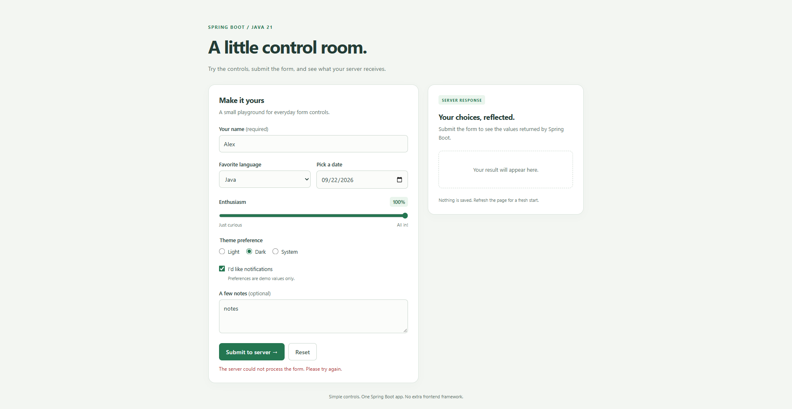

# Spring Boot Controls Demo

A basic web app using **Java 21** and **Spring Boot 4.1.1**, with plain HTML, CSS, and JavaScript.



## Tech Stack

| Technology | Purpose |
| --- | --- |
| Java 21 | Backend language |
| Spring Boot 4.1.1 | Application configuration and executable JAR packaging |
| Spring Web MVC | REST controller and static web content, via `spring-boot-starter-webmvc` |
| Embedded Apache Tomcat | HTTP server |
| Jakarta Bean Validation | Server-side form validation, via `spring-boot-starter-validation` |
| HTML, CSS, and vanilla JavaScript | Responsive interface and form controls; Fetch API for JSON submissions |
| Maven | Dependency management, builds, and tests |
| JUnit Jupiter and AssertJ | HTTP integration tests, via `spring-boot-starter-test` |

The frontend is served from `src/main/resources/static`. This project does not use
Thymeleaf or a database; form submissions are validated and echoed without persistence.

## Requirements

- JDK 21 (set `JAVA_HOME` to your JDK 21 installation)
- Maven 3.6.3 or newer

## Run

```sh
mvn spring-boot:run
```

Open http://localhost:8080. Stop the app with Ctrl+C.

On this Windows machine, you can select the installed Java 21 JDK for the current PowerShell session:

```powershell
$env:JAVA_HOME = 'P:\Java\jdk-21.0.2'
$env:Path = "$env:JAVA_HOME\bin;$env:Path"
mvn spring-boot:run
```

## Try it

The page includes a text box, dropdown (combo box), slider with a live percentage,
date picker, radio buttons, checkbox, text area, submit button, and reset button.
Submit sends JSON to `POST /api/demo`; Spring Boot validates and echoes the values
for display alongside the form. Theme and notification selections are demonstration
values only. Nothing is stored, and no database or frontend build tooling is needed.

## Test and package

```sh
mvn clean verify
java -jar target/controls-demo-0.0.1-SNAPSHOT.jar
```

Integration tests start a real HTTP server and check the home page, form submission,
and rejection of invalid input. To use another port, pass `--server.port=8081` to the jar.

## Project structure

```text
src/main/java/com/example/controlsdemo/
├── ControlsDemoApplication.java       # Spring Boot entry point
└── DemoController.java                # POST /api/demo handler and validated Submission record

src/main/resources/
└── static/
    ├── index.html                    # Form page and submission summary
    ├── styles.css                    # Responsive page styling
    └── app.js                        # Form controls, JSON submission, and result display

src/test/java/com/example/controlsdemo/
└── ControlsDemoApplicationTests.java  # HTTP integration tests
```
